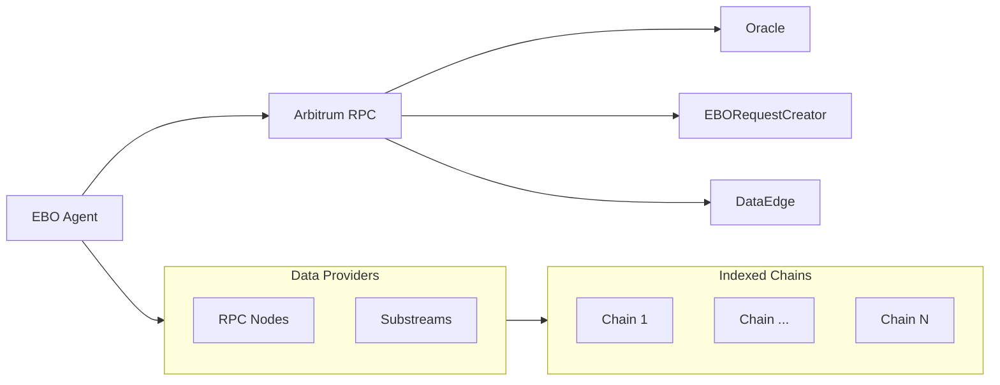

# ebo-agent

The Epoch Block Oracle (EBO) introduces the use of an optimistic oracle ([Prophet](https://docs.prophet.tech/)), enabling any off-chain agent to interact with it by creating requests, proposing responses, or disputing responses in a permissionless manner. This document outlines a comprehensive implementation strategy for the agent responsible for automating all workflows associated with EBO. Within this document, you will find a detailed presentation of the high-level architecture, code design, process flows, technology stack, and project estimations.

## Table of contents

* Background
* Install
* Usage
* Contributing

## Background

The EBO agent is an open-source tool designed to poll events from the relevant on-chain smart contracts on the Protocol chain (Arbitrum) and respond to these events with specific actions tailored to the flow requirements. Additionally, the agent will interface with blockchains supported by The Graph and perform block computations for each epoch as necessary. These computations are required for various scenarios, such as responding to a request, validating a proposal, and revalidating a proposal during a dispute.




## Install
```
$ pnpm install
```

## Usage

```
$ pnpm start
```

## Test

```
$ pnpm test
```

## Contributing

Prophet was built with ❤️ by [Wonderland](https://defi.sucks).

Wonderland is a team of top Web3 researchers, developers, and operators who believe that the future needs to be open-source, permissionless, and decentralized.

[DeFi sucks](https://defi.sucks), but Wonderland is here to make it better.