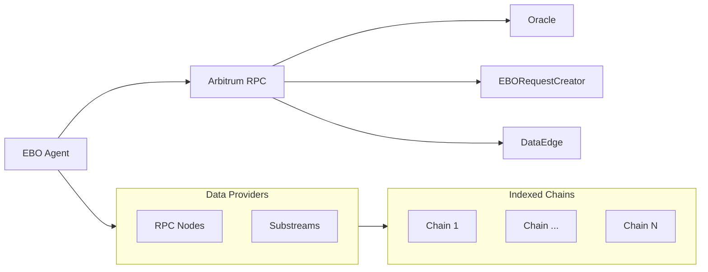

# ebo-agent

The Epoch Block Oracle (EBO) is an open-source tool designed to monitor indexed blockchains, track their latest blocks, and suggest updates for the corresponding block in each chain epoch.

## Table of contents

* Background
* Install
* Usage
* Contributing

## Background

The EBO Agent consumes blocks metadata from indexed chains and interacts with other agents through contracts run in the protocol chain.



## Install
```
$ pnpm install
```

## Usage

```
$ pnpm start
```

## Test

```
$ pnpm test
```

## Contributing

Prophet was built with ❤️ by [Wonderland](https://defi.sucks).

Wonderland is a team of top Web3 researchers, developers, and operators who believe that the future needs to be open-source, permissionless, and decentralized.

[DeFi sucks](https://defi.sucks), but Wonderland is here to make it better.